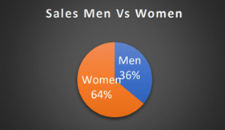
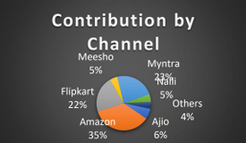

# 🔍 Unlocking Insights: Business Intelligence Solutions for Amazon's Success

This project explores how Amazon leverages Business Intelligence (BI) to drive innovation, enhance customer experiences, and stay competitive in the global e-commerce ecosystem. The report analyzes Amazon’s data architecture, BI tools (like AWS QuickSight, Redshift, SageMaker), and cultural integration of data-driven decision-making.

## 📌 Project Overview

- A research project under BBA curriculum
- Focuses on Amazon’s use of BI tools across operations, logistics, personalization, and seller support
- Includes competitor analysis with Alibaba, Walmart, and Shopify

## 📚 Contents

- Introduction to Amazon's BI strategy  
- Research Objectives  
- Literature Review  
- Methodology & Data  
- Key Findings & Recommendations  
- Bibliography

### 🔹 Sales by Gender

> Female customers showed higher overall purchase contribution during Diwali sales.

### 🔹 Sales by Channel Contribution

## 🧠 Key Insights

- Amazon uses QuickSight, Forecast, SageMaker, Redshift, and Kinesis for intelligent decisions
- Data is central to personalization, pricing, and seller success
- Cultural commitment to BI at all leadership levels
- Benchmarking with global competitors reveals common BI trends

## 🧾 Submitted By

**Anshika Sharma**  
BBA (2023–2026), Semester II  
Dr. Akhilesh Das Gupta Institute of Professional Studies (ADGIPS), GGSIPU

📄 [Read Full Report](AmazonBI-Strategy.pdf)

---

